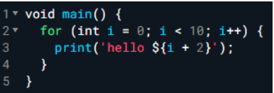
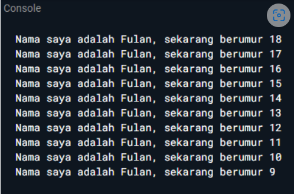
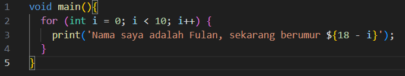

# Soal 1

Modifikasilah kode pada baris 3 di VS Code atau Editor Code favorit Anda berikut ini agar mendapatkan keluaran (output) sesuai yang diminta!

Output yang diminta:

## Jawaban:

# Soal 2

Mengapa sangat penting untuk memahami bahasa pemrograman Dart sebelum kita menggunakan framework Flutter ? Jelaskan!

## Jawaban:

Sangat penting untuk memahami bahasa pemrograman Dart sebelum menggunakan framework Flutter karena beberapa alasan:

1. Dasar Pemrograman: Dart adalah bahasa pemrograman yang digunakan untuk membuat aplikasi Flutter. Memahami dasar-dasar pemrograman Dart seperti variabel, kontrol struktur, fungsi, dan objek akan membantu memahami bagaimana Flutter bekerja.
2. Konsep Pemrograman Berorientasi Objek: Dart adalah bahasa pemrograman berorientasi objek, yang berarti bahwa perlu memahami konsep-konsep seperti kelas, objek, inheritance, dan polymorphism. Memahami konsep-konsep ini akan membantu membuat kode yang lebih efektif dan efisien.
3. Penggunaan Widget: Flutter menggunakan widget sebagai komponen dasar untuk membuat antarmuka pengguna. Memahami bagaimana menggunakan widget dan mengatur layout akan membantu membuat aplikasi yang lebih menarik dan interaktif.
4. Penggunaan Library dan Package: Dart memiliki banyak library dan package yang dapat digunakan untuk memperluas fungsionalitas aplikasi. Memahami bagaimana menggunakan library dan package akan membantu membuat aplikasi yang lebih kompleks dan canggih.
5. Penggunaan Asynchronous Programming: Dart memiliki fitur asynchronous programming yang memungkinkan membuat kode yang lebih efisien dan tidak memblokir. Memahami bagaimana menggunakan asynchronous programming akan membantu membuat aplikasi yang lebih responsif dan cepat.

# Soal 3

Rangkumlah materi dari codelab ini menjadi poin-poin penting yang dapat gunakan untuk membantu proses pengembangan aplikasi mobile menggunakan framework Flutter.

## Jawaban:

