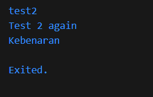
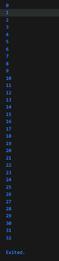
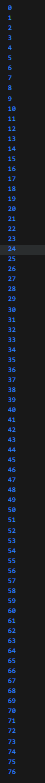
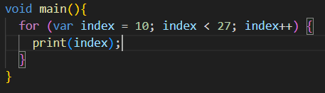
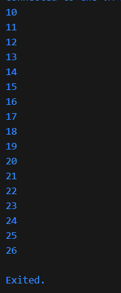
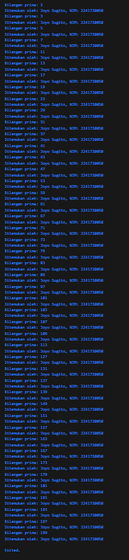

### Praktikum 1
* ketika nilai variabel dari test sama dengan pemilihan maka akan melakukan print pada fungsi pemilihan yang sama

* ketika melakukan langkah 3 akan terjadi error karena variabel test sudah digunakan sebelumnya sehingga untuk agar tidak error maka merubah variabel dari langkah 1 atau langkah 3 agar dapat dijalankan

### Praktikum 2
* code yang dijalankan error karena variabel counter belum diberikan nilai, untuk memperbaiki nya memberikan nilai variabel connter dengan nilai 0 dan hasil dari perulangan adalah 

* code akan menampilkan angka 0 sampai 76

### praktikum 3
* code yang dijalankan menghasilkan perulangan 10 sampai 26, code diperbaiki menjadi

* code tidak menghasilkan apa pun karena ketika index lebih dari 1 maka program akan melakukan syntax continue (melanjutkan perulangan tanpa melakukan print pada index yang terkait)

### tugas
* tugas2
1. 
2. 